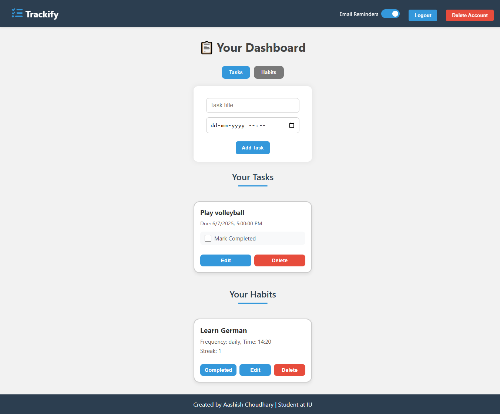

# 📋 Trackify – Task & Habit Tracker

**Trackify** is a personal task and habit tracking web application built using **Node.js**, **Express**, **MongoDB**, and **Vanilla JS**.  
It allows users to register, log in, manage daily tasks and habits, and receive email reminders.



---

## 🚀 Features

- ✅ User Registration & Login (with password hashing)
- 📅 Task creation and tracking 
- 📈 Habit tracking with scheduled reminders
- 📧 Email reminders (1 hour before task/habit time)
- 🔒 Toggle email notifications on/off
- 🧼 Clean and intuitive dashboard UI

---

## 🛠️ Tech Stack

- **Backend:** Node.js, Express
- **Database:** MongoDB (via Mongoose)
- **Frontend:** HTML, CSS, JavaScript
- **Email Service:** Nodemailer with Gmail App Password
- **Scheduling:** node-cron

---

## 🔐 Environment Variables

You must create a `.env` file in the `/Trackify` directory based on `.env.example`.

---

## 📦 Installation & Setup

1. Clone the repository:
    ```bash
    git clone https://github.com/aashish090/IU_DLBCSPJWD01-Trackify.git
    ```

2. Navigate to the project folder:
    ```bash
    cd IU_DLBCSPJWD01/Trackify
    ```

3. Install dependencies:
    ```bash
    npm install
    ```

4. Create your `.env` file:
    ```bash
    cp .env.example .env
    ```

5. Start the server:
    ```bash
    node server.js
    ```

6. Visit `http://localhost:3000` in your browser.

---

## 🎯 Usage

- Register a new user or log in.
- Add tasks with titles, and due times.
- Create habits and set reminder times.
- Enable/disable email reminders from your dashboard.

---

## ✅ Test Cases 

### **User Authentication**

**Test Case 1: User can sign up with valid credentials.**
- Navigate to the registration page.
- Enter a valid name, email, and password.  
- Click the **"Register"** button.  
**Expected:** User is authenticated and redirected to the login. 

**Test Case 2: User cannot sign up with an existing email.**
- Navigate to the registration page.  
- Enter an already registered email and password.  
- Click the **"Register"** button.  
**Expected:** Error message shown — **"Email already registered"**  

**Test Case 3: User can log in with valid credentials**
- Navigate to the login page.  
- Enter a valid email and password.  
- Click the **"Login"** button.  
**Expected:** User is authenticated and redirected to the dashboard.  

**Test Case 4: User cannot log in with invalid credentials.**
- Navigate to the login page.  
- Enter invalid email or wrong password.  
- Click the **"Login"** button.  
**Expected:** Error message shown — **"Invalid credentials"**  

**Test Case 5: User cannot access dashboard without logging in**
- Log out  
- Manually enter `/dashboard` in the browser.  
**Expected:** Redirected to the login page.  

**Test Case 6: User can log out**
- Log in  
- Click the **"Logout"** button.  
**Expected:** Session ends, redirected to login.  

---

### ✅ **Task Management**

**Test Case 1: User can add a task**
- Click **"Add Task"**.  
- Enter task title and due date.  
- Click **"Save"**.  
**Expected:** Task appears in the dashboard list.  

**Test Case 2: User can mark a task complete.**
- Click the checkbox.
**Expected:** Task is marked complete and visually updated.  

**Test Case 3: Completed task should not trigger reminder**
- Mark a task as completed.  
- Wait for reminder time.  
**Expected:** No reminder email is sent.  

**Test Case 4: Email reminder sent 1 hour before task is due.**
- Add a task due in 1 hour.  
- Ensure email reminders are enabled. 
**Expected:** Email is received with task title and due time.  

---

### ✅ **Habit Tracking**

**Test Case 1: User can add a habit.**
- Click **"Add Habit"**. 
- Enter habit title, frequency, and time.  
- Click **"Save"**.  
**Expected:** Habit appears in the habit list.  

**Test Case 2: User can complete a habit.**
- Click on the **"Complete"** button.
**Expected:** Habit’s streak increases, lastCompleted gets updated.  

**Test Case 3: Completed habit should not trigger reminder again on the same day**
- Complete a habit.  
- Wait for scheduled reminder time.  
**Expected:** No email is sent for that habit again that day.  

**Test Case 4: Email reminder sent 1 hour before habit time.**
- Add a habit with a time 1 hour ahead.  
- Wait  
**Expected:** Reminder email is sent before the habit time.  

---

### ✅ **Reminder Preferences & Account Settings**

**Test Case 1: User can toggle email reminders**
- Click the **"Toggle Email Reminders"** button.  
**Expected:** Reminders are disabled or enabled accordingly.  

**Test Case 2: Reminders are not sent when toggled off.**
- Disable reminders.  
- Wait for reminder schedule.  
**Expected:** No task or habit emails are received.  

**Test Case 3: User can delete account.**
- Click **"Delete Account"**.  
- Confirm the action.  
**Expected:** User account, tasks, and habits are permanently deleted.
